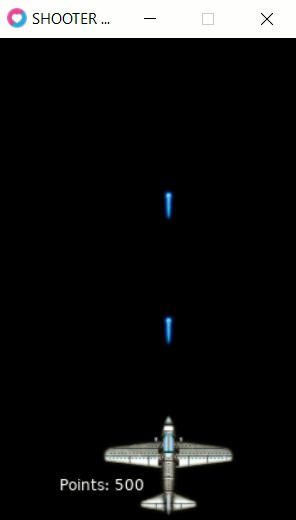
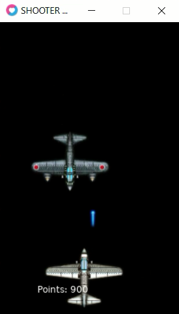

# SHOOTER AIRPLANES
👨‍💻ESTE É UM JOGO DE TIRO NO ESTILO ARCADE, ONDE O JOGADOR CONTROLA UM AVIÃO QUE PODE SE MOVER HORIZONTALMENTE E ATIRAR PROJÉTEIS PARA DESTRUIR INIMIGOS.


 
 <br>

## DESCRIÇÃO:
Este é um jogo de tiro no estilo arcade, onde o jogador controla um avião que pode se mover horizontalmente e atirar projéteis para destruir inimigos. O objetivo principal é acumular pontos ao destruir os inimigos enquanto evita colisões que resultam em game over. Uma característica marcante desse jogo são os efeitos sonoros.

## COMO JOGAR?
- **Execute o Jogo**: 
  - Abra o terminal (ou prompt de comando) e navegue até a pasta `./CODIGO`.
  - Execute o comando:

   ```bash
   love .
   ```

  - Isso deve abrir uma janela do LÖVE com o jogo do SHOOTER AIRPLANES.

- **Movimentação**:
  - Use as setas `esquerda` e `direita` para mover o avião horizontalmente na tela.
  
- **Atirar**:
  - Pressione a barra de espaço (`espaço`) para atirar projéteis. Cada vez que você pressiona a barra de espaço, um projétil é disparado da posição atual do avião.

- **Objetivo**:
  - Acumule pontos destruindo os inimigos que aparecem na parte superior da tela. Cada inimigo destruído aumenta sua pontuação em 50 pontos.

- **Evitar Colisões**:
  - Evite colisões com os inimigos. Se um inimigo colidir com o avião, o jogo termina (game over).

- **Pontuação**:
  - A pontuação é exibida no canto superior esquerdo da tela. Você começa com zero pontos e acumula pontos ao destruir inimigos. A cada 50 pontos, a velocidade do avião aumenta, tornando o jogo mais desafiador.

- **Game Over**:
  - Quando o jogador colide com um inimigo, o jogo termina. Uma mensagem será exibida indicando a pontuação final.
  - Para reiniciar o jogo, pressione a tecla `a`. O jogo será reiniciado com o avião na posição inicial, a pontuação zerada, e a dificuldade inicial restaurada.

## NÃO SABE?
- Entendemos que para manipular arquivos em muitas linguagens e tecnologias, é necessário possuir conhecimento nessas áreas. Para auxiliar nesse aprendizado, oferecemos cursos gratuitos disponíveis:
* [CURSO DE LOVE](https://github.com/VILHALVA/CURSO-DE-LOVE)
* [CURSO DE LUA](https://github.com/VILHALVA/CURSO-DE-LUA)
* [CONFIRA MAIS CURSOS](https://github.com/VILHALVA?tab=repositories&q=+topic:CURSO)

## CREDITOS:
- [PROJETO CRIADO PELO "wesleycsj"](https://github.com/wesleycsj/ShooterAirplanes)
- [VEJA O VIDEO DESSE PROJETO](https://youtu.be/v_B9D12DxDM?si=plpsWqQqMzxBd1nW)
- [PROJETO ATUALIZADO PELO VILHALVA - VERSÃO 11.5 DO LOVE](https://github.com/VILHALVA)
